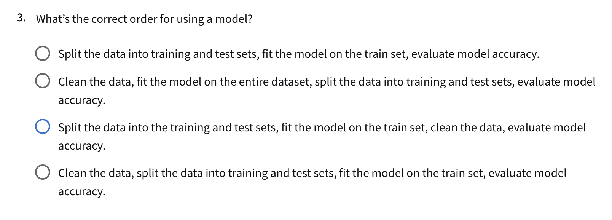

In 2019 is when my journey down the rabbithole of data leakage really got its start. I was 
working on several machine learning projects at a non-profit startup focused on detecting
"early signals" in healthcare datasets. For example, predicting patient dropout during the
course of clinical treatment or classifying mothers at risk of early-term pregnancy. 

At the time, I was surprised to find that obviously incorrect application of machine learning 
techniques were able to make it through the review process in scientific journals... Easily avoidable 
data leakage mishaps! I began making a list of all the 
[different types of data leakage](./2019-06-26-The-Many-Faces-of-Data-Leakage.md).

Over the years, I kind of became a data leakage police officer -- and felt like a broken record. In
presentations, during project/code reviews, while reading papers: data leakage just seemed to be
everywhere, all the time.

Since 2019, there have been a lot of great articles/papers that have come out
addressing this issue, but unfortunately, even in 2024, I'd say data leakage is much 
more common than anyone should be comfortable with. 

**The most common data leakage issue by far is this type of pipeline**:
1. Clean/preprocess the data (imputation, normalization, dimensionality reduction, etc)
2. Split dataset into train, val, test
3. Fit the model on train

Where might this problem be arising? 

Well, I think a lot of people literally learn to set up machine learning projects the wrong way. Many
ML blogs set up problems the wrong way. But worse, I've noticed that many online courses set the problems
up the wrong way too!

For example, what motivated this write-up is that I decided to check out the 
[IBM AI Engineering Professional Certificate](https://www.coursera.org/professional-certificates/ibm-machine-learning). The
amount of typos in some of the courses is pretty mind blowing on its own. But in the very first week of the
very first course they teach the data leakage pipeline outlined above -- and make not a single comment about data leakage
while doing so! To make matters worse, they then have the following question in the weekly quiz, which you must
select an incorrect answer for to get it right:

Remember this always: **Anything that needs to be learned must be learned on the training set only.**

**Here is a more proper ML workflow**:
1. **Split the Dataset First**: Split the dataset into training, validation, and test sets before any data preprocessing.
2. **Develop Preprocessing Pipeline on the Training Data Only**: Fit any preprocessing steps (e.g., scaling, dimensionality reduction) on the training set only.
  * e.g., for standardizing, compute the mean and standard deviation on the training set alone.
  * e.g., for dimensionality reduction (like PCA), fit the transformation only on the training data
3. **Apply the Preprocessing Pipeline to Validation and Test Sets**: The learned transformations are applied to
    the validation and test sets without refitting. (These represent unseen datasets -- 
4. **Fit the Model on the Training Data**: Train the model using only the preprocessed training data.
5. **Evaluate on Validation and Test Sets**: Use the preprocessed validation set for tuning hyperparameters and the test set for final evaluation.

The idea is that during training your validation set is simulating unseen data and after grid searching
the training and validation sets to death, then your test set steps in as the stand-in for unseen data.
This is an important process! Do it wrong and you will be overly optimistic about your model. (Note that
this rule still applies in cross validation settings where what's considered the training and validation
sets are fold dependent.)

The only cleaning and preprocessing that should be done on the full dataset prior to splitting are
"rule based" transformations that are not learned on the dataset. A good example is taking a logarithm,
which requires no learning. Sometimes a Box-Cox transformation is preferred over a simple logarithm, but
if this is the case than the transformation must be learned on the training set only. Techniques like
imputation and dimensionality reduction are almost always learning something prior to their application,
thus must be learned on the training set only.

A good way to think is that you're not just buidling a "machine learning model" but that you're 
building a "machine learning pipeline" -- and that entire pipeline must respect the dangers of
data leakage!

Thus, I think the most ideal ML workflow goes something like this:
1. **Split the Dataset First**
2. **Compose a Complete Machine Learning Pipeline**
  * Such a pipeline includes both a preprocessing and modeling components.
4. **Fit the Pipeline on the Training Data Only**
5. **Evaulate the Pipeline During Optimization on the Validation Set**
6. **Evaluate the Pipeline After Optimization on the Test Set**

Ok, that about wraps it up for today!

El Fin.

